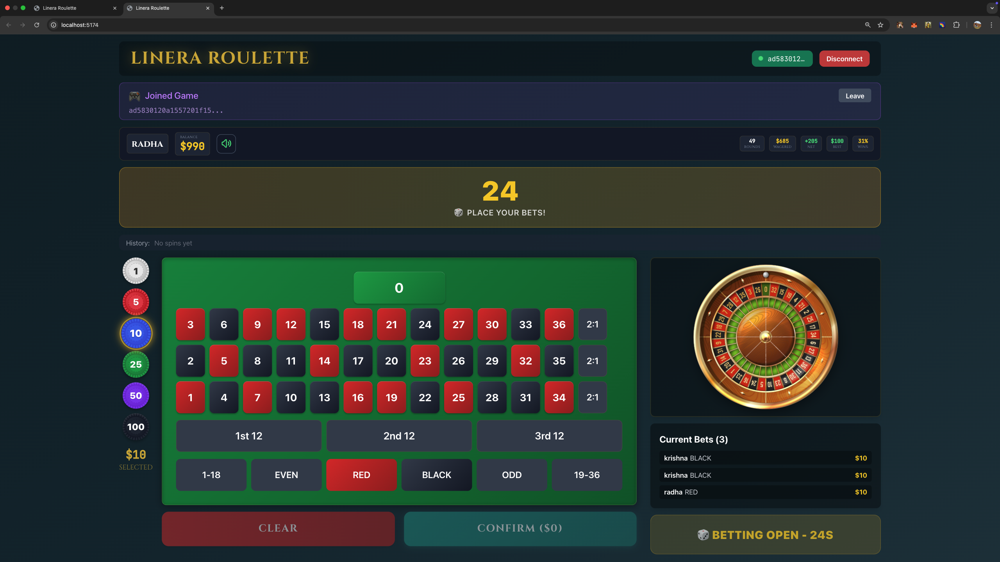
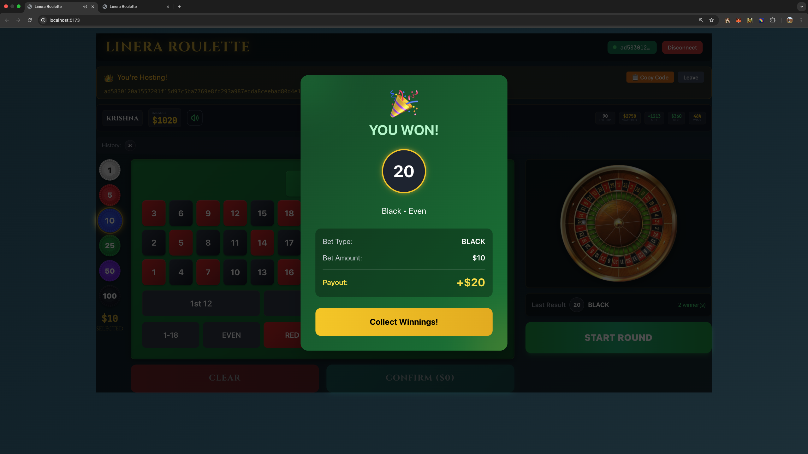
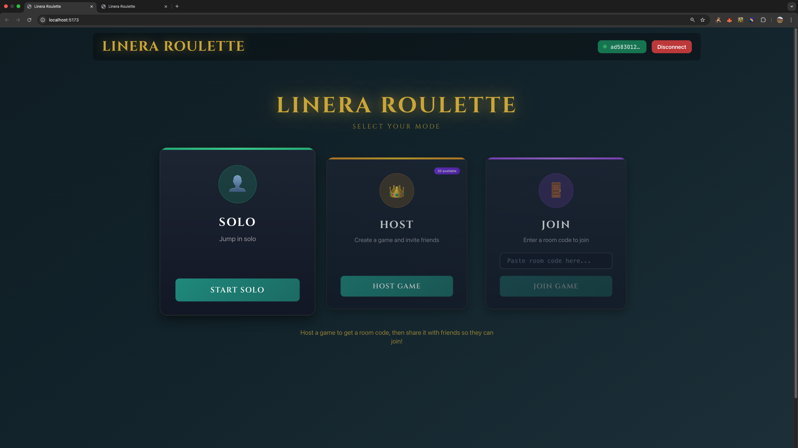
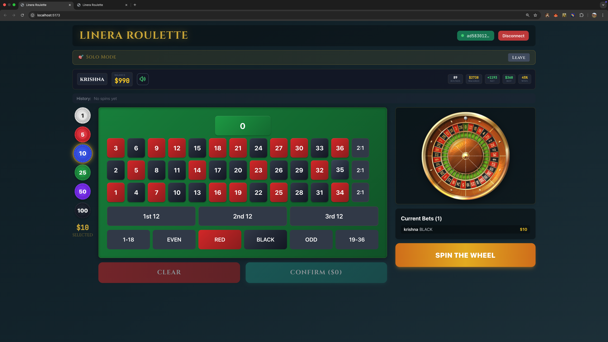

# Linera Roulette

Multiplayer roulette game on Linera microchains with real-time cross-chain gameplay.

## Screenshots

### Game Modes


### Gameplay


### Multiplayer


### Host Room


## Features

- **Real-time Multiplayer**: Cross-chain gameplay with host/join mode
- **Verifiable RNG**: On-chain random number generation
- **13 Bet Types**: Straight, split, street, corner, line, column, dozen, red/black, odd/even, high/low
- **Live on Conway Testnet**: 20 chains deployed and operational

## Tech Stack

- **Backend**: Rust + Linera SDK 0.15.11
- **Frontend**: React + TypeScript + Vite + TailwindCSS
- **Network**: Conway Testnet (Linera)

## Try It Out

### Play Live Deployment
The game is already running on Conway Testnet - no setup required! Use the App ID above to connect.

### Run Locally (Optional)
```bash
./run.bash
```

### Deploy Your Own Instance (Optional)
```bash
./deploy.sh
```

## Live Deployment

🎰 **Ready to Play**: Already deployed and running on Conway Testnet

- **App ID**: `a204d053e0a7cf735df997e23e4d2d5e9c61cf3f539fcfdab1e6a737a0279da8c1e97e53240f5b8a86b1f2de7aa99b05f82bc2dbc8eb64ec2b419f98d3f17f5a`
- **Network**: Conway Testnet
- **Chains**: 20 pre-deployed game rooms ready for multiplayer

No deployment needed - just connect to the testnet and start playing!

## Game Modes

1. **Solo**: Play on your own chain
2. **Host**: Create a room for others to join
3. **Join**: Connect to an existing game room

## Architecture

```
Player Chain 1  ←→  Host Chain  ←→  Player Chain 2
     ↓                  ↓                  ↓
  Own bets        Game state         Own bets
  Own balance     All players        Own balance
```

- Microchain-based state isolation
- Host chain manages game state
- Player chains handle bets via cross-chain messages
- Deterministic RNG using block timestamps and chain IDs
